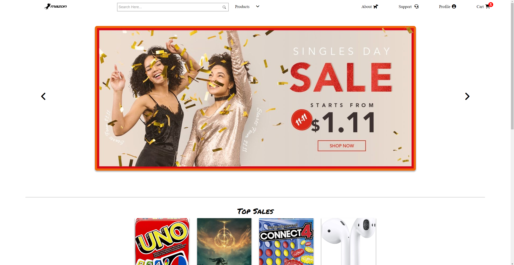
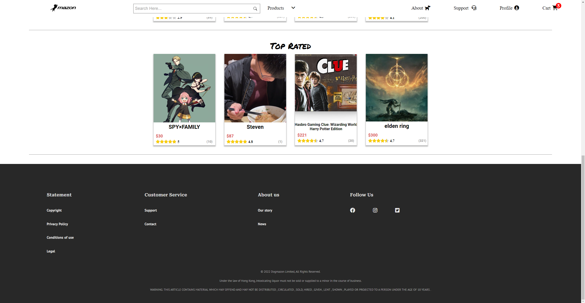

# Dogmazon
Dogmazon is a responsive online shopping web application, which facilitates buying and selling actions by using REST API and CRUD Operations.
> Notice: This project is still on development status (06/4/2022). The website will be hosted after completion.
## Technologies
ReactJS, CSS, Python Flask, MongoDB
## Highlights
#### Design and Architecture
* Fully Responsive
* RESTful API
* CRUD Operation
#### Search and Filter
* Search engine system
* Category and Sorting product filters
#### Rating and Comments
* Ratings from one to five
* Leave your Suggestions through comments
#### Security
* Password Hashing
* 2-Factor Authentication
* Forgot Password
#### Selling your products
* Seller-friendly product upload session
#### Customer Service
* Contact-us
* FAQ Page

## Preview

## Contributors
 This web application was developed in a team of 4 people.
 Credit to development team members:
- [Rudy Yen](https://github.com/yenloned)
- [Steven Tsui](https://github.com/steventsui123)
- Thomas Chan

## Learn More

You can learn more in the [Create React App documentation](https://facebook.github.io/create-react-app/docs/getting-started).

To learn React, check out the [React documentation](https://reactjs.org/).

To learn Flask, check out the [Flask documentation](https://flask.palletsprojects.com/en/2.1.x/).

To learn MongoDB, check out the [MongoDB documentation](https://www.mongodb.com/docs/).
